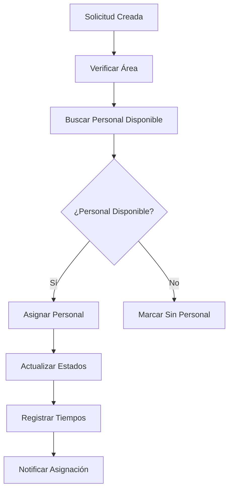

# 🏥 Sistema de Gestión Hospital Susana López de Valencia

## 📋 Descripción General

Sistema completo de gestión de solicitudes de mantenimiento con numeración automática, asignación inteligente de personal y tracking de tiempos de respuesta, desarrollado por **Ing. Paul Eduardo Muñoz R.**

### 🚀 Características Principales

- **🔢 Numeración Automática**: SOLBIO00001, SOLMEC00001, SOLINFRA00001
- **🎯 Asignación Inteligente**: Personal especializado por área técnica
- **⏱️ Tracking de Tiempos**: Métricas de respuesta en tiempo real
- **🌐 Sistema Cloud**: Sincronización automática con Airtable
- **📱 Multi-dispositivo**: Acceso desde cualquier computador
- **🔐 Control de Acceso**: Códigos únicos de 4 dígitos

---

## 🏗️ Arquitectura del Sistema

### Componentes Principales

```
📁 Sistema Hospital/
├── 🌐 Portal de Solicitudes (portal-solicitudes.html)
├── 👨‍💼 Portal de Gestión (portal-gestion.html)
├── ⚙️ Configuración API (airtable-config.js)
├── 🧪 Sistema de Testing (test-sistema-completo.html)
├── 🛡️ Funciones Netlify/
│   ├── airtable-proxy.js
│   ├── user-management.js
│   ├── hello.js
│   └── simple-debug.js
└── 📋 Configuración (netlify.toml)
```

### Base de Datos (Airtable)

**Tablas Configuradas:**
- `Solicitudes`: Requests de mantenimiento con numeración automática
- `Tecnicos`: Personal de soporte por áreas especializadas
- `Usuarios`: Control de acceso con códigos únicos
- `SolicitudesAcceso`: Gestión de nuevos usuarios

---

## 🔢 Sistema de Numeración Automática

### Formatos por Área

| Área | Prefijo | Formato | Ejemplo |
|------|---------|---------|---------|
| **Ingeniería Biomédica** | `SOLBIO` | SOLBIO00001 | SOLBIO00001 |
| **Mecánica** | `SOLMEC` | SOLMEC00001 | SOLMEC00001 |
| **Infraestructura** | `SOLINFRA` | SOLINFRA00001 | SOLINFRA00001 |

### Características

- ✅ **Incremental Automático**: Números secuenciales únicos
- ✅ **Prevención de Duplicados**: Validación en tiempo real
- ✅ **Sincronización Cloud**: Contadores sincronizados en Airtable
- ✅ **Recuperación Automática**: Análisis de números existentes al iniciar

### Código de Implementación

```javascript
// Sistema de numeración en airtable-config.js
this.numerationSystem = {
    counters: {
        'INGENIERIA_BIOMEDICA': { prefix: 'SOLBIO', current: 0 },
        'MECANICA': { prefix: 'SOLMEC', current: 0 },
        'INFRAESTRUCTURA': { prefix: 'SOLINFRA', current: 0 }
    },
    
    generateNumber(area) {
        this.counters[area].current++;
        return `${this.counters[area].prefix}${String(this.counters[area].current).padStart(5, '0')}`;
    }
};
```

---

## 🎯 Sistema de Asignación Inteligente

### Funcionalidades

#### 🤖 Auto-Asignación
- **Por Área**: Asignación automática según especialización
- **Por Prioridad**: Solicitudes críticas tienen preferencia
- **Por Disponibilidad**: Solo personal disponible es asignado

#### 👨‍🔧 Gestión de Personal
- **Estados**: Disponible, Ocupado, Inactivo
- **Especialización**: Por área técnica
- **Carga de Trabajo**: Tracking de solicitudes asignadas

### Proceso de Asignación



### Código de Asignación

```javascript
async function asignarTecnicoASolicitud(solicitudId, tecnicoId) {
    // 1. Verificar disponibilidad
    const tecnico = await this.getTecnicos().find(t => t.id === tecnicoId);
    
    // 2. Actualizar solicitud
    await this.updateSolicitud(solicitudId, {
        tecnicoAsignado: tecnico.nombre,
        estado: 'ASIGNADA',
        fechaAsignacion: new Date().toISOString()
    });
    
    // 3. Actualizar técnico
    await this.updateTecnico(tecnicoId, { 
        estado: 'ocupado',
        solicitudActual: solicitudId
    });
    
    return { success: true, tecnico, tiempos: ... };
}
```

---

## ⏱️ Sistema de Tiempo de Respuesta

### Métricas Configuradas

| Prioridad | Tiempo Límite | Color | Acción |
|-----------|---------------|-------|---------|
| **CRÍTICA** | 2 horas | 🔴 Rojo | Alerta inmediata |
| **ALTA** | 4 horas | 🟡 Amarillo | Seguimiento cercano |
| **MEDIA** | 24 horas | 🔵 Azul | Seguimiento normal |
| **BAJA** | 72 horas | 🟢 Verde | Seguimiento estándar |

### Cálculos Automáticos

```javascript
const timeTracker = {
    calcularTiempoRespuesta(fechaCreacion, fechaAsignacion) {
        const inicio = new Date(fechaCreacion);
        const fin = fechaAsignacion ? new Date(fechaAsignacion) : new Date();
        return fin - inicio;
    },
    
    evaluarTiempo(milliseconds, prioridad) {
        const limite = this.limitesTiempo[prioridad];
        if (milliseconds > limite) return { status: 'urgente', mensaje: 'Tiempo excedido' };
        if (milliseconds > limite * 0.8) return { status: 'normal', mensaje: 'Próximo a vencer' };
        return { status: 'rapido', mensaje: 'Dentro del tiempo' };
    }
};
```

### Estadísticas Generadas

- ✅ **Tiempo Promedio** por área
- ✅ **Tiempo Mínimo/Máximo** histórico
- ✅ **Solicitudes Vencidas** contador
- ✅ **Eficiencia por Técnico** métricas

---

## 🔐 Sistema de Control de Acceso

### Proceso de Acceso

1. **📝 Solicitud**: Usuario completa formulario
2. **👨‍💼 Aprobación**: Admin revisa en Portal de Gestión
3. **🎲 Generación**: Código único de 4 dígitos
4. **✅ Activación**: Usuario puede acceder al sistema

### Códigos de Acceso

```javascript
async function generateUniqueAccessCode() {
    const usuarios = await this.getUsuarios();
    const existingCodes = usuarios.map(u => u.codigoAcceso).filter(Boolean);
    
    let code;
    do {
        code = Math.floor(1000 + Math.random() * 9000).toString();
    } while (existingCodes.includes(code));
    
    return code;
}
```

### Validación de Acceso

```javascript
async function validateUserCredentials(email, codigoAcceso) {
    const user = await this.findUserByEmail(email);
    
    if (!user) return { valid: false, error: 'Usuario no encontrado' };
    if (user.estado !== 'ACTIVO') return { valid: false, error: 'Usuario inactivo' };
    if (user.codigoAcceso !== codigoAcceso) return { valid: false, error: 'Código incorrecto' };
    
    return { valid: true, user };
}
```

---

## 🌐 Configuración de Airtable

### Variables de Entorno (Netlify)

```env
AIRTABLE_API_KEY=your_api_key_here
AIRTABLE_BASE_ID=your_base_id_here
```

### Configuración Local

```javascript
// En airtable-config.js para desarrollo local
this.baseUrl = 'https://api.airtable.com/v0/appFyEBCedQGOeJyV';
this.directApiKey = 'your_api_key_here';
```

### Estructura de Tablas

#### Tabla: Solicitudes
```javascript
{
    numero: 'SOLBIO00001',           // Generado automáticamente
    servicioIngenieria: 'INGENIERIA_BIOMEDICA',
    tipoServicio: 'MANTENIMIENTO_CORRECTIVO',
    prioridad: 'CRITICA',
    equipo: 'Ventilador X',
    ubicacion: 'UCI 201',
    descripcion: 'Descripción del problema',
    solicitante: 'Juan Pérez',
    estado: 'PENDIENTE',
    tecnicoAsignado: 'Carlos López',
    fechaCreacion: '2025-01-20T10:00:00.000Z',
    fechaAsignacion: '2025-01-20T10:30:00.000Z'
}
```

#### Tabla: Tecnicos
```javascript
{
    nombre: 'Carlos López',
    email: 'carlos@hospital.com',
    area: 'INGENIERIA_BIOMEDICA',
    tipo: 'ingeniero',
    especialidad: 'Ventiladores',
    estado: 'disponible'
}
```

---

## 🚀 Guía de Instalación

### 1. Configuración de Airtable

1. **Crear Base en Airtable**
   - Ir a [airtable.com](https://airtable.com)
   - Crear nueva base: "Hospital Solicitudes"

2. **Crear Tablas**
   ```
   📋 Solicitudes
   👥 Tecnicos
   🔐 Usuarios  
   📝 SolicitudesAcceso
   ```

3. **Obtener Credenciales**
   - API Key desde Account Settings
   - Base ID desde Help > API Documentation

### 2. Configuración de Netlify

1. **Deploy Files**
   ```bash
   # Subir archivos a Netlify
   - portal-solicitudes.html
   - portal-gestion.html
   - airtable-config.js
   - netlify.toml
   - netlify/functions/
   ```

2. **Variables de Entorno**
   ```
   Site Settings > Environment Variables:
   AIRTABLE_API_KEY = tu_api_key
   AIRTABLE_BASE_ID = tu_base_id
   ```

### 3. Configuración Local (Desarrollo)

1. **Actualizar airtable-config.js**
   ```javascript
   this.directApiKey = 'tu_api_key_aquí';
   // En la línea correspondiente
   ```

2. **Servidor Local**
   ```bash
   # Usar Live Server o similar
   npx http-server .
   ```

---

## 📱 Guía de Uso

### Para Usuarios (Portal de Solicitudes)

1. **📝 Crear Solicitud**
   - Acceder con email + código de 4 dígitos
   - Seleccionar área técnica
   - Completar formulario
   - ✅ Número automático generado

2. **📋 Seguimiento**
   - Ver solicitudes en "Mis Solicitudes"
   - Estado en tiempo real
   - Técnico asignado
   - Tiempo de respuesta

### Para Administradores (Portal de Gestión)

1. **👨‍💼 Gestión de Solicitudes**
   - Dashboard con métricas
   - Filtros avanzados
   - Asignación manual/automática
   - Seguimiento de tiempos

2. **👥 Gestión de Personal**
   - Registro de técnicos
   - Estados: disponible/ocupado/inactivo
   - Carga de trabajo
   - Especialización por área

3. **🔐 Control de Acceso**
   - Aprobar solicitudes de acceso
   - Generar códigos únicos
   - Gestión de usuarios

---

## 🧪 Testing del Sistema

### Test Automático

Acceder a `test-sistema-completo.html` para:

- ✅ **Test de Conexión**: Verificar Airtable
- ✅ **Test de Numeración**: Validar generación automática
- ✅ **Test de Asignación**: Verificar algoritmos
- ✅ **Test de Tiempos**: Validar cálculos
- ✅ **Test Integral**: Flujo completo end-to-end

### Comandos de Debugging

```javascript
// En consola del navegador
debugAirtableConnection();           // Estado general
window.airtableAPI.getStatus();      // Estado detallado
window.airtableAPI.numerationSystem; // Info numeración
```

---

## 📊 Métricas y Reportes

### Dashboard Automático

- **📈 Total Solicitudes** por área
- **⏱️ Tiempos Promedio** de respuesta
- **👥 Personal Disponible** por especialización
- **🔴 Solicitudes Vencidas** alertas

### Exportación de Datos

```javascript
// Generar reporte de tiempos
async function exportarReporteTiempos() {
    const stats = timeTracker.generarEstadisticas(solicitudes);
    // Copiar al portapapeles o descargar
}
```

---

## 🔧 Personalización

### Agregar Nueva Área

1. **Actualizar numeración**
   ```javascript
   // En airtable-config.js
   this.numerationSystem.counters['NUEVA_AREA'] = { 
       prefix: 'SOLNUEVA', 
       current: 0 
   };
   ```

2. **Actualizar mapeos**
   ```javascript
   const areas = {
       'NUEVA_AREA': 'Nueva Área Técnica'
   };
   ```

### Modificar Tiempos Límite

```javascript
// En airtable-config.js
this.timeTracker.limitesTiempo = {
    'CRITICA': 1 * 60 * 60 * 1000,  // 1 hora
    'ALTA': 2 * 60 * 60 * 1000,     // 2 horas
    // ... personalizar según necesidades
};
```

---

## 🛠️ Solución de Problemas

### Problemas Comunes

#### ❌ Error de Conexión Airtable
```
Verificar:
1. API Key correcta
2. Base ID correcto
3. Permisos de la API Key
4. Variables de entorno en Netlify
```

#### ❌ Numeración No Funciona
```
Verificar:
1. Conexión a Airtable activa
2. Tabla 'Solicitudes' existe
3. Campo 'servicioIngenieria' presente
4. Contadores inicializados
```

#### ❌ Asignación Falla
```
Verificar:
1. Personal registrado en área correcta
2. Estado 'disponible' del técnico
3. Tabla 'Tecnicos' configurada
4. Campos 'area' y 'estado' presentes
```

### Logs de Debug

```javascript
// Habilitar logs detallados
console.log('🔍 Estado sistema:', window.airtableAPI.getStatus());
console.log('🔢 Contadores:', window.airtableAPI.numerationSystem.counters);
console.log('👥 Personal:', await window.airtableAPI.getTecnicos());
```

---

## 🔒 Seguridad

### Mejores Prácticas

- ✅ **API Keys**: Nunca exponer en código cliente
- ✅ **Proxy Netlify**: Oculta credenciales en producción
- ✅ **Códigos Únicos**: 4 dígitos únicos por usuario
- ✅ **Validación**: Server-side en funciones Netlify
- ✅ **CORS**: Configurado correctamente

### Variables Sensibles

```javascript
// ❌ NO hacer en producción
const API_KEY = 'patXXXXXX...'; 

// ✅ Usar variables de entorno
const API_KEY = process.env.AIRTABLE_API_KEY;
```

---

## 📞 Soporte

### Desarrollador

**👨‍💻 Ing. Paul Eduardo Muñoz R.**
- 🏥 Hospital Susana López de Valencia E.S.E.
- 📧 Contacto disponible a través del hospital

### Documentación Técnica

- 📋 **Airtable API**: [airtable.com/api](https://airtable.com/api)
- 🌐 **Netlify Functions**: [docs.netlify.com](https://docs.netlify.com)
- ⚡ **JavaScript ES6+**: [developer.mozilla.org](https://developer.mozilla.org)

---

## 📈 Roadmap Futuro

### Mejoras Planificadas

- 📱 **App Móvil**: React Native o PWA
- 📧 **Notificaciones**: Email automático
- 📊 **Dashboard Avanzado**: Charts y métricas
- 🔄 **Integración WhatsApp**: Notificaciones
- 📋 **Reportes PDF**: Generación automática
- 🎯 **IA Predictiva**: Asignación inteligente
- 📦 **Inventario**: Gestión de repuestos

### Versión Actual: v4.0

- ✅ Sistema de numeración automática
- ✅ Asignación inteligente de personal  
- ✅ Tracking completo de tiempos
- ✅ Portal dual (Solicitudes + Gestión)
- ✅ Integración completa con Airtable
- ✅ Sistema de testing automatizado

---

## 📄 Licencia

Sistema desarrollado exclusivamente para **Hospital Susana López de Valencia E.S.E.** por **Ing. Paul Eduardo Muñoz R.**

**Restricciones:**
- ✅ Uso interno del hospital
- ❌ Distribución externa sin autorización
- ✅ Modificaciones permitidas para mejoras
- ❌ Uso comercial por terceros

---

## 🙏 Agradecimientos

- 🏥 **Hospital Susana López de Valencia E.S.E.** - Por la oportunidad
- 👨‍⚕️ **Personal Médico y Técnico** - Por los requerimientos
- 🛠️ **Equipo de Ingeniería** - Por las pruebas y feedback
- 💡 **Usuarios Finales** - Por la retroalimentación continua

---

*Desarrollado con ❤️ para mejorar la eficiencia del mantenimiento hospitalario*

**© 2025 - Ing. Paul Eduardo Muñoz R. - Hospital Susana López de Valencia E.S.E.**